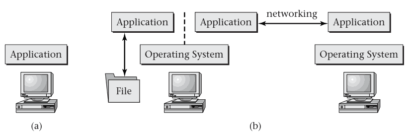

CPSC 4420 Operating Systems
===========================

About Me
--------

Professor Craton

Anything you want to know?

Introductions
-------------

- Name
- Major(s)
- Favorite thing you did over break?

Syllabus
--------

[Link](../syllabus.html)

Quizzes
-------

- Given regularly at beginning and end of class
- Should be easy for you
- Allow me to confirm that everyone is keeping up with course material

Labs
----

- Code-based labs that do not parse or compile will be awarded zero credit
- Outside resources are acceptable e.g. Stack Overflow, etc
- Help from peers is acceptable
- Your solution must be yours, and you must fully understand it

Lab Grading
-----------

- Most labs will be graded for correctness and code quality, as in other courses
- Labs may occasionally be graded orally at my discretion

1.2 What is an Operating System
===============================

What does the OS do?
--------------------

- Handles concurrency to share hardware between tasks
- Manages interactions between tasks
- May support high-level interactions (files, etc)
- Connecting to other systems

---

---

Can we have a computer without an operating system?

Abstraction
-----------

- Provides application programs with an abstract view of underlying hardware
- Manages low-level details

Application Programming Interface
---------------------------------

- API
- All OS features made available to application programs
- Run programs, open files, create network connections, etc

Kernel
------

- Core of the operating system
- Provides programmatic interfaces
- Typically has no direct visibility from the user

Shell
-----

- Provides a way for users to interact with the kernel
- Usually provides a way to start programs
- `sh`, `tcsh`, `bash`

Desktop Environments
--------------------

- Creates a graphical shell for the user
- Provides similar features as a text-based shell
- `KDE`, `GNOME`, `Explorer`
