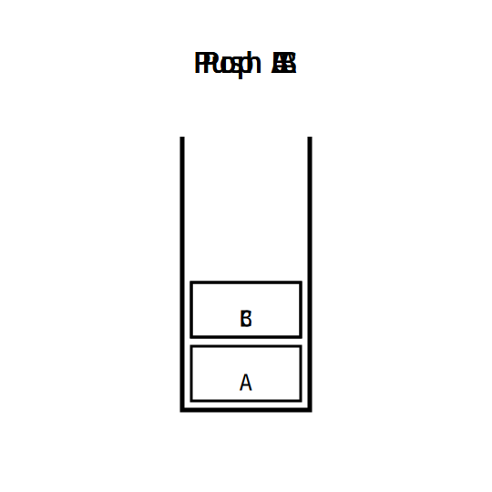

# Appendix A - Stacks

## Stack Data Structure

- Abstract data type
- Supports `push` and `pop`
- Last in, first out (LIFO)

---


---



## Control Abstraction

- Create organized sections of executable code that execute in well-understood ways and can be reused

## Subroutine

- Performs operations for the caller while the caller waits
- Arguments, or _actual parameters_, are passed to subroutines and mapped to _formal parameters_ from the subroutine definition
- Subroutines that can return values can be called _functions_

## Call Stack

- Memory space for functions to use to store local variables, return addresses, and other data
- Function calls push a new frame to the stack
- Returns pop their frame when they are finished with it

## DrawSquare Example

```c
void DrawSquare(int x, int y, int size) {
  /* Draw a square using 4 lines */
  DrawLine(x, y, x, y + size);
  DrawLine(x + size, y, x + size, y + size);
  DrawLine(x, y, x + size, y);
  DrawLine(x, y + size, x + size, y + size);
}
```

---


## Call stack review resources

- [Short Video Lecture](https://www.youtube.com/watch?v=Q2sFmqvpBe0)
- [Wikipedia](https://en.wikipedia.org/wiki/Call_stack)

## Parameter Passing

## Pass by Value

- Actual parameter values are made available to the subroutine
- Modification of values will not impact the caller
- This may involved making a copy in memory

## Pass by Reference

- Actual parameters are references to data from the caller
- Modification of values will impact caller
- Should not involve copying data

## C

- Pass by value

---

```c
#include <stdio.h>

void increment(int i) {
  // This will not change the callers value
  i = i + 1;
}

int main(void) {
  int i = 0;
  increment(i);
  printf("%d\n", i);
}
```

---

- If we want to be able to modify values, we need to pass values by reference
- We can't do this is C, but we can use pointers passed by value to emulate it

---

```c
#include <stdio.h>

void increment(int* i) {
  // This will change the callers value
  *i = *i + 1;
}

int main(void) {
  int i = 0;
  increment(&i);
  printf("%d\n", i);
}
```

---

If we allow C++, we can use a proper pass by reference mode.

```c++
#include <stdio.h>

void increment(int &i) {
  // This will change the callers value
  i = i + 1;
}

int main(void) {
  int i = 0;
  increment(i);
  printf("%d\n", i);
}
```

## Hardware

- Most ISAs pass values using a new stack frame and/or shared registers
- Hardware is necessarily pass by value
- Any pass by reference implementation needs to be built on values

## Variable Numbers of Arguments

- It can sometimes be helpful to accept a different number of arguments
- One example of this is `printf` in C

---

```c
int printf ( const char * format, ... );
```

---

## Function Returns

- End the function
- Return some value
