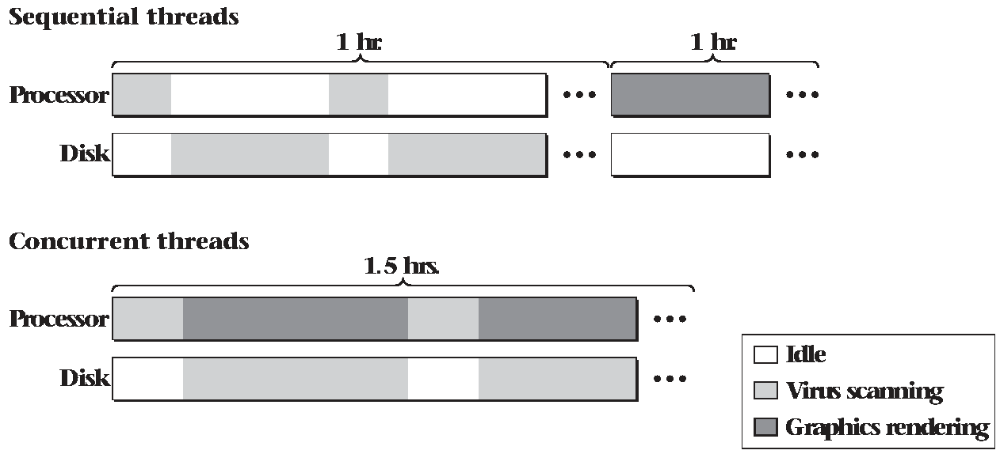
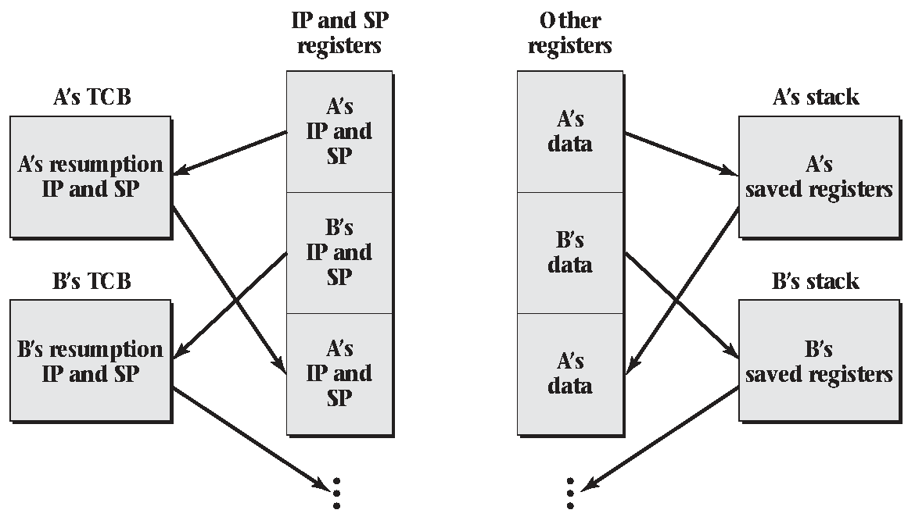

2.4 Switching Between Threads
=============================

Switching
---------

- A single-threaded CPU can run only one thread at a time
- A multi-threaded CPU still supports a finite number of concurrent threads
- We need mechanism for moving execution from one thread to another

---



Pausing
-------

- Stop a sequence of instructions from running
- Start up again later
- Something else can use the CPU in between

New Instruction
---------------

- switchFromTo(currentThread, newThread)
- Instructs the CPU to move its execution from one thread to another

---

Thread A            Thread B
------------------- ---------
A1
A2
switchFromTo(A, B)
                    B1
                    B2
                    switchFromTo(B, A)
A4
A5

---

What does it mean to switch threads?

Consider:

- Instruction Pointer
- Stack Pointer
- Register Values

Changing Threads
----------------

- Store all required registers (IP, SP, data registers, etc)
- Update instruction pointer

Thread Control Block
--------------------

- TCB
- Kernel data structure for storing thread parameters
- Address of block may be used to identify threads (A and B in previous examples)

What about memory
-----------------

- Each thread's memory should remain accessible and largely unchanged after switching
- The stack should be preserved exactly
- The stack is pushed to hold thread state when switching just like when calling a function

Pseudocode
----------

```
  Push registers to outgoing thread's stack
  Store stack pointer in outgoing->sp
  Load stack pointer from next->sp
  Store `restore` address into outgoing->ip
  Jump to next->ip
restore:
  pop registers from the now resumed outgoing thread
```

---



Security
--------

- On most systems, memory protections are enforced
- A process can't jump into another processes memory
- The user mode thread switching described is not possible in practice

Kernel
------

- The kernel must be responsible for thread management and switching

Yield
-----

- Simplified version of `switchFromTo`
- Take no parameters
- Informs the kernel that the current thread is ready to take a break

Yield Implementation
--------------------

```
outgoing = current
next = chooseNextThread()
current = next // Maintain global variable
switchFromTo(outgoing, next)
```

Multiple processors
-------------------

- A modern system can run multiple threads simultaneously in hardware
- We need to maintain information about the `n` running threads on our `n` processors
- When a thread yields on one CPU, we can begin running a new thread there

2.5 Pre-emptive multitasking
============================

Cooperative Multitasking
-------------------------

- Threads run until they yield time back to the OS
- This is the system we have described so far

---

What are some issue with cooperative multitasking?

Cooperative Multitasking Issues
-------------------------------

- One thread may not be as cooperative and hog time from others
- The OS doesn't know when it will next have CPU time to perform device I/O

Pre-emptive Multitasking
------------------------

- Allows the OS to take control and switch to another thread

Interrupts
----------

- CPUs generally execute the next instruction
- Devices have the ability to interrupt this flow and redirect execution to an interrupt handler
- Using timer and interrupt handlers, the OS can build pre-emptive multitasking

2.6 Security and Threads
========================

DoS
---

- One thread hogs execution preventing the system from running properly

Race Conditions
---------------

- If not programmed carefully, threads can lead to undefined and unexpected behavior
- This behavior can sometimes be exploitable by an attacker
