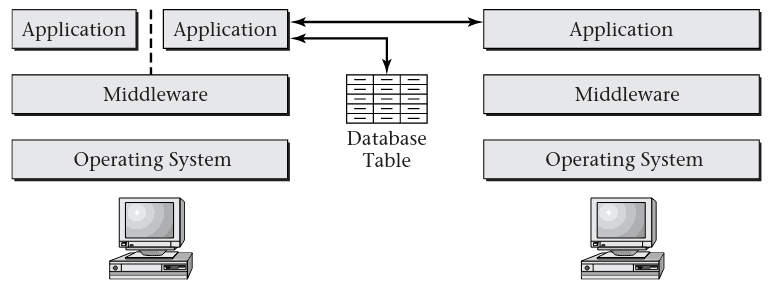

# 1.5 Multiple Computations on One Computer

## Resources

- Limited CPU time, disk access bandwidth, memory bandwidth
- Multiple applications using resources simultaneously

## Concurrency

- Make efficient use of resources
- When we aren't actively using the CPU because we are waiting on I/O, another program can use it

## Thread

- Fundamental unit of concurrency
- Sequence of programmed actions
- Each program includes at least one thread

## Process

- Container for one or more threads
- Protects threads from interactions from unrelated threads running on the same computer
- Threads in different processes do not share memory

---

## Thread APIs

- Create
- Kill
- Switch

## Scheduling

- OS will have many threads that can be run
- Limited CPUs are available
- OS must select thread to run

# 1.6 Controlling Interactions Between Computations

## Dependencies

- Sometimes threads are not fully independent
- One thread may generate data that another consumes
- These threads need to interact via _synchronization_

---

What if thread A is waiting for thread B and thread B is waiting for thread A?

## Deadlock

- Cyclic waiting
- Must be addressed to prevent freezes
- Difficult to solve generally

## Transaction

- Unit of computation with no externally visible internal state
- Computation succeeds or fails as a unit
- Useful concurrency primitive

## Accidental Interaction

- Threads share memory, so they may interact unintentionally
- This can be mitigated on some systems using virtual memory
