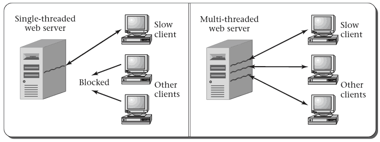

2.2 Example Multi-threaded Program
==================================

---

- [Example program](../examples/2-simple-thread/threads.c)
- [Example program 2](../examples/2-simple-thread/thread-args.c)

2.3 Reasons for Concurrent Threads
==================================

---

Why is it desirable for the computer to execute multiple threads concurrently, rather than waiting for one to finish before starting another?

Responsiveness
--------------

- Allows rapid response to input even while working on other computations
- This is demonstrated by the example as both threads can respond to a timer

Resource Utilization
--------------------

- The computer has many hardware resources (CPU, memory, disks, etc)
- We want use all of these resources efficiently
- We need to be able to pause a thread waiting on I/O to allow the CPU to be used for other tasks

Modularization
-------------

- We may also like threads for creating cleaner programs
- Aspects of computation can be handled independently

Web Server Example
------------------

- What does a web server do?
- How might threads help?

---

Multiprocessor Example
----------------------

- Nearly all systems now have multiple processors
- How are threads useful here?
- `make -j`
