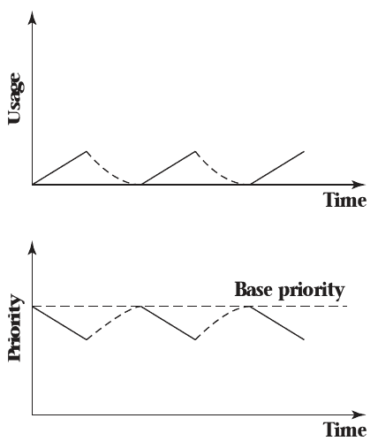
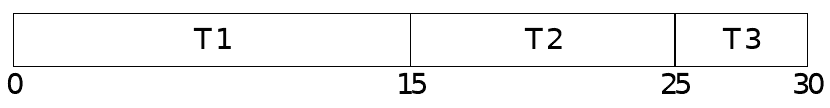
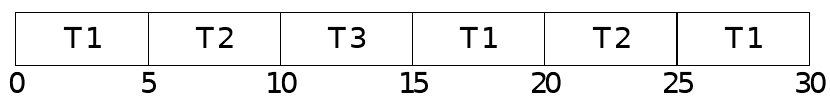

3.5 Dynamic Priority Scheduling
===============================

Priority based scheduling
-------------------------

- Useful in limited circumstances
- Helpful as a framework for more advanced scheduling
- What if the OS could automatically adjust priorities?

Earliest Deadline First
-----------------------

- Useful in real-time applications with deadlines
- Assign highest priority to thread with the earliest deadline
- Improves upon rate-monotonic scheduling

Example Processes
-----------------

Process  Execution Time  Period
-------  --------------  ------
P1       1               8
P2       2               5
P3       4               10 

---

Decay Usage Scheduling
----------------------

- Suitable for systems without deadlines
- Lower priority for threads that run more
- Allows quick, interactive tasks to execute instantly while moving compute-intensive tasks to the background

---

3.6 Proportional Share Scheduling
=================================

Fairness
--------

- Equal sharing of resources my be more important than other factors

Goal
----

- Provide tunable fair sharing of resources between threads and/or system users

Mechanisms
----------

- Lottery Scheduling
- Weighted Round-robin
- Weighted Fair Queuing

Lottery Scheduling
------------------

- Uniform time slices for all threads
- No formal rotation
- Next thread to run selected randomly using assigned weights

Lottery Scheduling
------------------

- Simple
- Technically correct in the long run
- May produce undesirable behavior in the short run

Weighted Round Robin
--------------------

- Threads with larger allocations are assigned larger time slices
- Reduces context switches

Example
-------

- Three threads (T1, T2, T3)
- Allocated resources in the proportions 3:2:1

---

Weighted Fair Queuing
----------------------

- Threads with smaller allocation have to sit out on some rounds
- Keeps accumulated runtimes very close to desired proportions

---

Linux Example
-------------

- `nice` values feed into scheduler
- Weight is approximately 1024 / (1.25^niceness)
- `renice` can adjust niceness
- renice -n {niceness} -p {pid}
