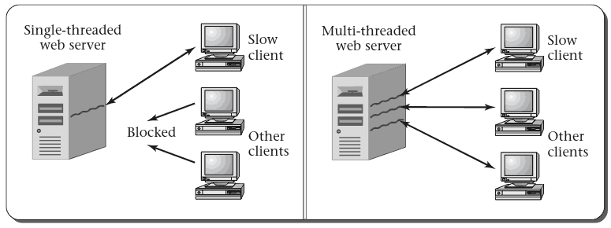

{height=540px}

## Programs and Threads

- Programs are a collection of instructions
- A thread is a collection of instructions being executed
- Every running program has at least one thread

---

## Process

- Most operating systems implement a container to hold threads
- This container is called a process

---

## Lifetime

- Threads exist from the time their first instruction begins executing until the time of last instruction execution
- Threads with overlapping lifetimes are running concurrently
- A key feature of most operating systems is allow threads to run concurrently

# 2.3 Reasons for Concurrent Threads

---

Why is it desirable for the computer to execute multiple threads concurrently, rather than waiting for one to finish before starting another?

## Responsiveness

- Allows rapid response to input even while working on other computations
- This is demonstrated by the example as both threads can respond to a timer

## Resource Utilization

- The computer has many hardware resources (CPU, memory, disks, etc)
- We want use all of these resources efficiently
- We need to be able to pause a thread waiting on I/O to allow the CPU to be used for other tasks

## Modularization

- We may also like threads for creating cleaner programs
- Aspects of computation can be handled independently

## Web Server Example

- What does a web server do?
- How might threads help?

---

## Multiprocessor Example

- Nearly all systems now have multiple processors
- How are threads useful here?
- `make -j`
