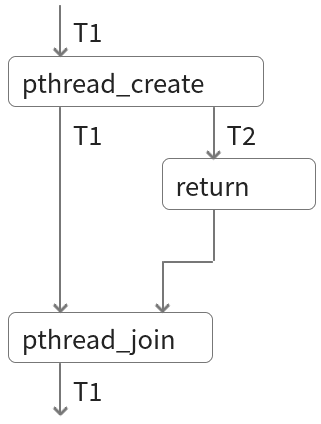
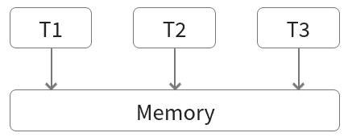

4.1 Syncronization and Deadlocks
================================

Interaction
-----------

- We have seen how threads are created, scheduled, and executed
- The tools we have so far allow threads to run independently
- Sometimes threads have dependencies

Indpendent Execution
--------------------

- Create threads
- Run independently
- Combine thread results

---



---

What if threads need to share data?

Memory
------

- A pointer to a memory location can be shared when creating a thread
- The thread can allocate memory and use stack allocated memory
- Global variables and data are accessible to all threads

---



---

What behaviors do we need to avoid if we have shared memory?

4.2 Races and the Need for Mutual Exclusion
===========================================

---


Thread Race Conditions
----------------------

- Two threads may be operating concurrently in an unsyncronized manner
- This can lead to output that differs over different program runs
- This may lead to bugs or unexpected behavior

Example
-------

```c
if(seatsRemaining > 0){
  dispenseTicket();
  seatsRemaining = seatsRemaining - 1;
} else {
  displaySorrySoldOut();
}
```

---

Can the example sell more tickets than are available?

---

What if it is running in multiple threads?

---

[examples/race/tickets.c](../examples/race/tickets.c)

Core Issue
----------

- Multiple threads operating on the same data structure with interleaving modifications

Solution
--------

- Allow only one thread to access the data at a time
- Sometimes referred to as locking the data structure
- This creates mutual exclusion (mutex)

Thread Safe Operations
---------------

- Only reading from the same data structure
- Interleaving operations without data dependencies
- Interleaving atomic operations
