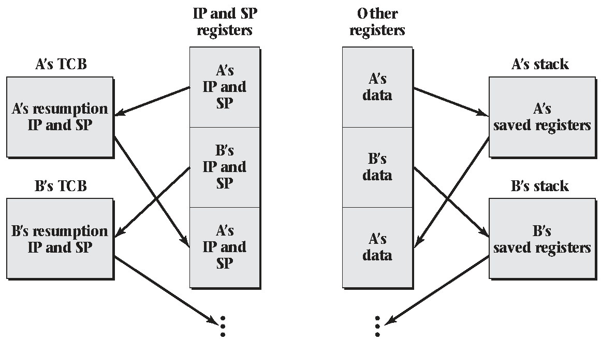

# 2.4 Switching Between Threads

## Switching

- A single-threaded CPU can run only one thread at a time
- A multi-threaded CPU still supports a finite number of concurrent threads
- We need mechanism for moving execution from one thread to another

---


## Pausing

- Stop a sequence of instructions from running
- Start up again later
- Something else can use the CPU in between

## Stopping Processes

- Stop the process:
  - `kill -STOP [pid]`
- Resume execution:
  - `kill -CONT [pid]`

## New Instruction

- switchFromTo(currentThread, newThread)
- Instructs the CPU to move its execution from one thread to another

---

What does it mean to switch threads?

Consider:

- Instruction Pointer
- Stack Pointer
- Register Values

## Changing Threads

- Store all required registers (IP, SP, data registers, etc)
- Update instruction pointer

## Thread Control Block

- TCB
- Kernel data structure for storing thread parameters
- Address of block may be used to identify threads

## What about memory

- Each thread's memory should remain accessible and largely unchanged after switching
- The stack should be preserved exactly
- The stack is pushed to hold thread state when switching just like when calling a function

## Pseudocode

```
  Push registers to outgoing thread's stack
  Store stack pointer in outgoing->sp
  Load stack pointer from next->sp
  Store `restore` address into outgoing->ip
  Jump to next->ip
restore:
  pop registers from the now resumed outgoing thread
```

---



## Security

- On most systems, memory protections are enforced
- A process can't jump into another processes memory
- The user mode thread switching described is not possible in practice

## Kernel

- The kernel must be responsible for thread management and switching

## Yield

- Simplified version of `switchFromTo`
- Take no parameters
- Informs the kernel that the current thread is ready to take a break

## Yield Implementation

```
outgoing = current
next = chooseNextThread()
current = next // Maintain global variable
switchFromTo(outgoing, next)
```

## Multiple processors

- A modern system can run multiple threads simultaneously in hardware
- We need to maintain information about the `n` running threads on our `n` processors
- When a thread yields on one CPU, we can begin running a new thread there
