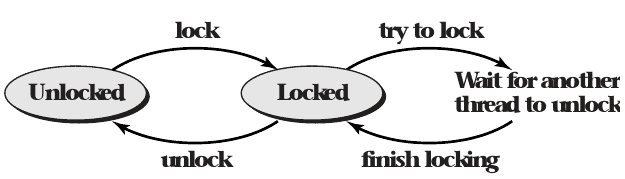
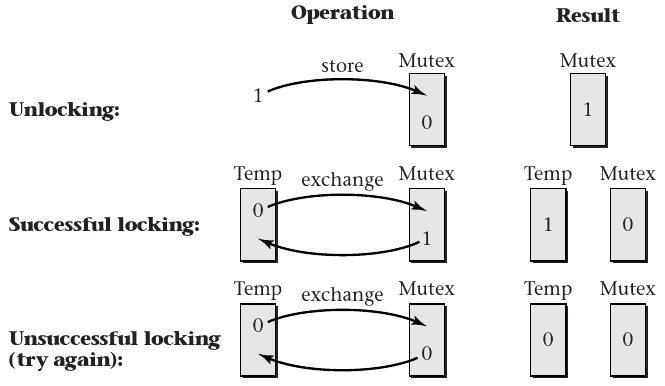
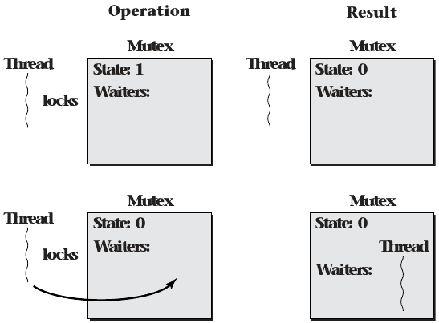
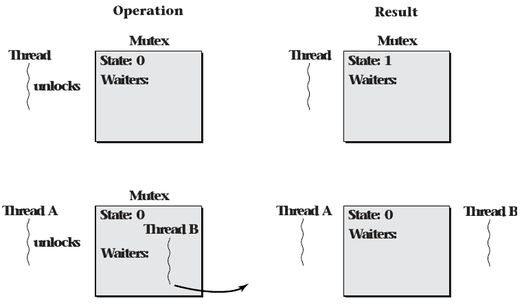

- Midterm Exam next Monday, March 6th
- Lab questions?

4.3 Mutexes and Monitors
========================

Data Races
----------

- Sharing data between threads can cause issues
- This can be resolved by using a lock to gain exclusive access

Mutual Exclusion Lock
---------------------

- Provided by the OS
- Commonly known as a mutex

Mutex POSIX API
---------------

States
------

- Locked (held by some thread)
- Unlocked (not held by any thread)

Unlock Operation
----------------

- Only allowed when the mutex is locked
- Returns immediately

Lock Operation
--------------

- Allowed on locked and unlocked mutexes
- May force the caller to wait until the lock is unlocked by another thread

---



POSIX API
---------

```c
pthread_mutex_t my_mutex;
pthread_mutex_init(&my_mutex, 0);
pthread_mutex_lock(&my_mutex);
// operate on the protected data structure
pthread_mutex_unlock(&my_mutex);
// destroy when done
pthread_mutex_destroy(&my_mutex);
```

Exceptional Circumstances
-------------------------

- Unlocking an already unlocked mutex
- Unlocking a mutex locked by a different thread
- Locking  a mutex that we already hold

Mutex Types
-----------

- PTHREAD_MUTEX_DEFAULT - Produces undefined behavior in exceptional cases
- PTHREAD_MUTEX_ERROR_CHECK - Error codes returned for exceptional cases

Mutex Types
-----------

- PTHREAD_MUTEX_NORMAL - Self-deadlocks are possible. Produces undefined behavior in other cases
- PTHREAD_MUTEX_RECURSIVE - A counter is used for lock state. A mutex can be locked multiple times and must be unlocked the same number of times before truly being unlocked

Monitors
--------

- OOP approach to thread safety
- Provide more structured mutexes

Monitor Objects
---------------

- All state is private
- Objects include a mutex in addition to their state
- Every public method begins by locking the mutex and ends by unlocking it

Races
-----

- A race on object state will be impossible if the object is a monitor

Language support
----------------

- Can be automatic (e.g. `class monitor`)
- [`syncronized`](https://en.cppreference.com/w/cpp/language/transactional_memory#Synchronized_blocks) keyword provides object locking at the method level
- Can be [implemented manually](https://stackoverflow.com/a/48408987)

Mutex Implementation
--------------------

- Atomic instruction is needed that can modify memory and report its previous value
- [`swap`](https://en.wikibooks.org/wiki/X86_Assembly/Data_Transfer#Data_swap) to exchange a register value with memory is sufficient 

Spinlock
--------

- Memory value `1` is unlocked, `0` is locked
- Unlock by storing `1`
- Lock by swapping `0` with the mutex value
  - Locking succeeded if we get a `1` back
  - Otherwise, try until we get a `1` back

---

```lua
to lock mutex:
  let temp = 0
  repeat
    atomically exchange temp and mutex
  until temp = 1
```

---



Cache-conscious spinlocks
------------------------

- Wait for another thread to change the lock state before atomically locking it
- Avoids poor cache performance while waiting

---

```lua
to lock mutex:
  let temp = 0
  repeat
    atomically exchange temp and mutex
    if temp = 0 then
      while mutex = 0
        do nothing
  until temp = 1
```

Spinlocks
---------

- Explicitly waste CPU time
- Can be appropriate in the case where very little waiting is typically needed due to fast operations
- May not require a system call (see [futex](https://en.wikipedia.org/wiki/Futex))

Queuing Mutex
------------

- Avoids spinning
- Components
  - Mutex state
  - Wait queue for waiting threads
  - Cache-conscious spinlock to protect own state

---



---


