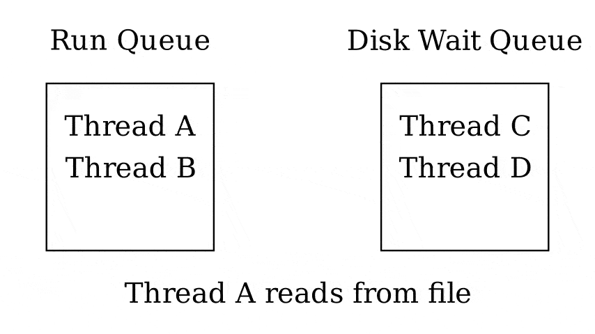

2.5 Pre-emptive multitasking
============================

Cooperative Multitasking
-------------------------

- Threads run until they yield time back to the OS

---

What are some issue with cooperative multitasking?

Cooperative Multitasking Issues
-------------------------------

- One thread may not be as cooperative and hog time from others
- The OS doesn't know when it will next have CPU time to perform device I/O

Pre-emptive Multitasking
------------------------

- Allows the OS to take control and switch to another thread

Interrupts
----------

- CPUs generally execute the next instruction
- Devices have the ability to interrupt this flow and redirect execution to an interrupt handler
- Using timer and interrupt handlers, the OS can build pre-emptive multitasking

2.6 Security and Threads
========================

DoS
---

- One thread hogs execution preventing the system from running properly

Race Conditions
---------------

- If not programmed carefully, threads can lead to undefined and unexpected behavior
- This behavior can sometimes be exploitable by an attacker

3.1 - 3.2 Thread States
=======================

Threads
-------

- A sequence of computational instructions run one after another
- Requires OS-level management for runtime data

Thread Switching
----------------

- A thread can ask the OS to run another thread by calling `yield()`
- The OS may take control of the CPU using pre-emptive multitasking

---

How does the OS determine which thread to switch to?

Scheduling
----------

- OS determines which process to run next
- Decision should be based on what the users of the system need
- Should optimize resource use

Waiting Threads
---------------

- Threads may be blocked waiting for I/O
- e.g. a webserver waiting on a disk access

Busy Waiting
------------

- Loop until the task is complete, checking frequently
- Wastes CPU time that could be used by other threads
- OS should implement a better mechanism

Queues
------

- Run queue - Queue of threads that can be run now
- Wait queue - Queue of threads waiting on something
    - 1 queue per wait reason

---

