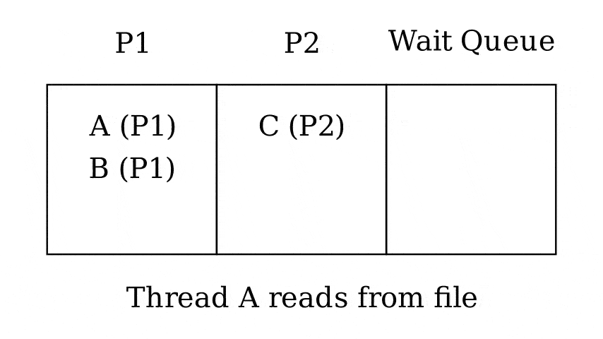

3.4 Fixed-priority scheduling
=============================

Scheduling Mechanisms
---------------------

- Priority
  - Fixed Priority (3.4)
  - Dynamic Priority
    - Earliest Deadline First (3.5.1)
    - Decay Usage (3.5.2)
- Proportional Share (3.6)

---

Priority
--------

- Number assigned to each thread
- May be assigned by a user and not adjusted automatically by the OS
- Note that higher priorities may be represented by lower numbers

Scheduling
----------

- The runnable thread with the highest priority will be run next

---

Advantages
----------

- Incredibly simple
- Can help meet some limited user needs

---

What are some weaknesses of fixed-priority scheduling?

Implementation
--------------

- Priority queue
- Most simply, a queue for each priority level

Ties
----

- Option 1 - Keep running the current thread (FIFO)
- Option 2 - Cycle highest priority thread in round-robin fashion (RR)

FIFO
----

- Allows the thread to complete it's work fastest
- Does not allow any other high priority threads to run

RR
---

- Allows all highest priority threads to run
- Delays work on one thread to service others

Niche
-----

- A busy high priority thread will consume all system resources
- In a carefully controlled system, they can be useful

Hard-real-time systems
----------------------

- Data and computation must be completed on a fixed timetable
- Aircraft
- Control systems
- [Rockets](https://www.youtube.com/watch?v=pmRrnyDssZc&t=360s)

Theorems
--------

- [Liu and Layland 1973](http://web.cs.wpi.edu/~cs3013/a09/Papers/Liu%20%26%20Layland%2C%20Real-time%20Scheduling.pdf)
- Simplify the process of analyzing systems with real-time constraints

Rate-monotonic scheduling
-------------------------

>  If the threads will meet their deadlines under any fixed priority assignment, then they will do so under an assignment that prioritizes threads with shorter periods over those with longer periods.

Starting Together
-----------------

> To check that deadlines are met, it suffices to consider the worst-case situation, which is that all the threads’ periods start at the same moment.

Gantt Chart
-----------

- Bar representing passage of time
- Can be used to analyze feasibility of a real-time schedule

---

{height=160px}

Example
-------

- Thread 1
  - Period and deadline: 4 seconds
  - Worst-case execution time: 2 seconds
- Thread 2
  - Period and deadline: 6 seconds
  - Worst-case execution time: 3 seconds

---

Can this application be serviced on a single CPU using fixed-priority scheduling?

---

{height=160px}

Example 2
---------

- Thread 1
  - Period and deadline: 4 seconds
  - Worst-case execution time: 2 seconds
- Thread 2
  - Period and deadline: 6 seconds
  - Worst-case execution time: **2** seconds

---

{height=160px}