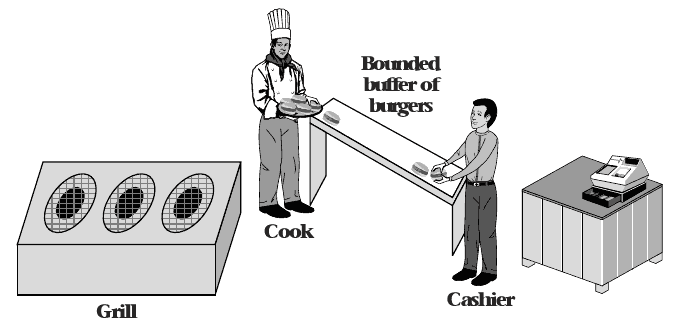
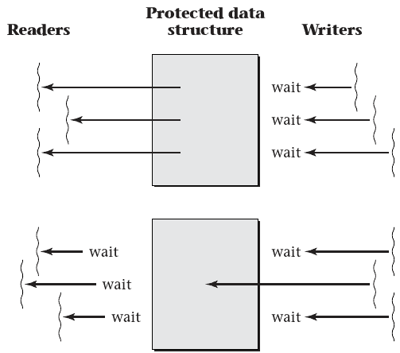

4.4 Other Synchronization Patterns
=================================

Producer-consumer model
-----------------------

- One thread produces data consumed by another thread
- Can be implemented sequentially
- Can be implemented as threads that wait on one another, but with limited concurrency

Concurrency
-----------

- Producer and consumer run at the same time
- Producer creates output and stores it
- Consumer grabs input as needed from storage

Bounded Buffer
--------------

- Provides storage space for producer output
- Limited in space because space is finite and larger size produces diminishing returns
- When buffer is empty, consumer must wait
- When buffer is full, producer must wait

---

Pipes
-----

- Provide OS-level support for bounded buffers between processes
- `du | sort -n`

Readers/Writers Locks
---------------------

- Alternative to mutex
- Allows lock to specify whether thread is reading or writing
- Only one writer may access the mutex at a time, but multiple readers are allowed

---

Barriers
--------

- Requires multiple concurrent threads to finish a task before moving on
- Similar to our use `pthread_join`, but does not require threads to terminate

Condtion Variables
------------------

- Provide a way to bundle multiple threads waiting on the same condition
- A signaling mechanism is used to wake threads when the condition is met

Semaphores
----------

- Somewhat similar to a mutex, but can take on values other than 0 and 1
- A semaphore that uses only 0 and 1 is a mutex
- Larger counter values can be useful when implementing bounded buffers or other concurrency mechanisms
