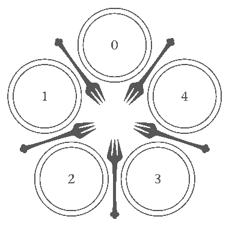

4.7 Deadlocks
=============

Concurrency
-----------

- Addresses problems of responsiveness and throughput
- Creates problems with races
- Races can be resolved using synchronization patterns

---

What problems can be caused by synchronization?

Example
-------

```python
to transfer amount from sourceAccount to destinationAccount:
  lock sourceAccount.mutex
  lock destinationAccount.mutex
  sourceAccount.balance = sourceAccount.balance - amount
  destinationAccount.balance = destinationAccount.balance + amount
  unlock sourceAccount.mutex
  unlock destinationAccount.mutex
```

Analysis
---------

- Mutexes prevent race conditions
- Transfers will generally work correctly
- What if two accounts transfer to one another concurrently?

Deadlock
--------

- Each thread lock the first mutex and waits for the second
- They now have a circular dependency and will never progress or unlock their mutex

Deadlock conditions
-------------------

1. Threads hold resources exclusively
2. Threads hold some resources while waiting for others
3. Resources cannot be removed from threads by force
4. Threads wait in a circular chain

---



Addressing Deadlocks
--------------------

- Prevention
- Detection and mitigation

Prevention Through Resource Ordering
------------------------------------

- Requires resources to have global IDs
- When locking resources, lock them in order by ID

Example
-------

```python
to transfer amount from sourceAccount to destinationAccount:
  lock min(sourceAccount, destinationAccount).mutex
  lock max(sourceAccount, destinationAccount).mutex
  sourceAccount.balance = sourceAccount.balance - amount
  destinationAccount.balance = destinationAccount.balance + amount
  unlock sourceAccount.mutex
  unlock destinationAccount.mutex
```

Linux Scheduler Example
-----------------------

```c
static void double_rq_lock(struct rq *rq1, struct rq *rq2)
  __acquires(rq1->lock)
  __acquires(rq2->lock)
  {
  BUG_ON(!irqs_disabled());
  if (rq1 == rq2) {
    raw_spin_lock(&rq1->lock);
    __acquire(rq2->lock);
     /* Fake it out ;) */
    } else {
    if (rq1 < rq2) {
      raw_spin_lock(&rq1->lock);
      raw_spin_lock_nested(&rq2->lock, SINGLE_DEPTH_NESTING);
    } else {
      raw_spin_lock(&rq2->lock);
      raw_spin_lock_nested(&rq1->lock, SINGLE_DEPTH_NESTING);
    }
  }
}

```

Detection
---------

- OS stores additional information about mutexes
- Track which thread holds a mutex
- Record which mutex a thread is waiting for
- Use this graph to periodically check for cycles (deadlocks)

---


Breaking the Deadlock
---------------------

- A thread can be rolled back to before it attempted the offending lock
- Most systems don't support rolling back threads
- Killing a thread is the typical solution

Immediate detection
-------------------

- If we detect deadlocks conditions when the last lock in the cycle is attempted, we can notify applications and they can choose to take appropriate action

4.8 Interaction of Synchronization and Scheduling
================================================

Synchronization and Scheduling
------------------------------

- Scheduler determines which thread to run
- Syncronization actions performed by running threads determine which other threads are runnable

Priority Inversion
------------------

- Causes lower priority threads to be favored over higher priority threads
- Can occur when threads of different priorities share a mutex

Short-term example
------------------

1. High priority thread waits on I/O
2. Low priority runs and aquires mutex
3. I/O completes an the high priority thread preempts the other
4. High priority thread can't aquire mutex
5. Low priority thread resumes

Short term issues
-----------------

- Generally not a significant problem
- Concurrent algorithms should be designed to only briefly hold a mutex
- High priority thread will resume promptly

Problematic Example
-------------------

1. High and medium threads both wait on I/O
2. Low priority thread runs and aquires mutex
3. All I/O completes and the high priority thread preempts the others
4. The high priority thread cannot aquire the mutex and waits
5. The medium priority thread runs and the low priority thread is unable to give up the mutex

Possible Solution
-----------------

- Boost priority of lower priority threads that haven't run much (e.g. decay usage scheduler)
- Creates problems on real-time systems where fixed priorities are desired

Priority Inheritance
--------------------

- A lower priority thread borrows the higher priority of a thread that is waiting on it
- Similar ideas can be applied to other schedulers

Convoy Phenomenon
--------------

- A popular mutex may constantly be contested among a number of threads
- This creates a "convoy" of threads in the waiting queue

Convoy Issues
-------------

- Increased context switched due to most lock operations requiring a context switch
- Decreased throughput due to increase context switching
- Breakdown of scheduler prioritization as many threads are not runnable
- Mutex weight queue manages scheduling in practice

Solution
--------

- Integrate the mutex wait queue with the scheduler and avoid simple FIFO behavior
- Allow a thread to relock a mutex is gave up during its time slice even though other threads are waiting on it

4.9 Non-blocking Synchronization
================================
