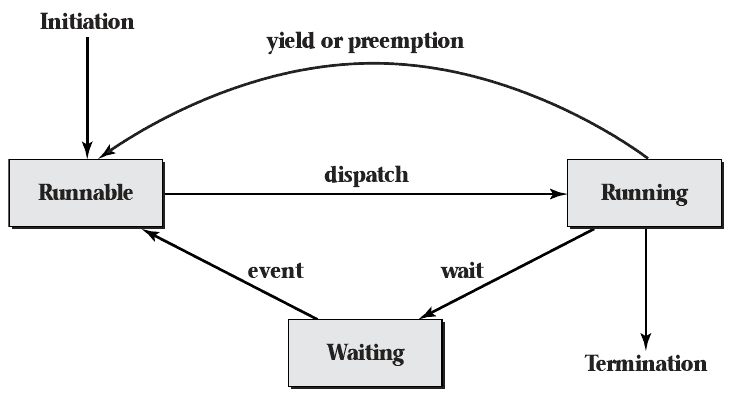
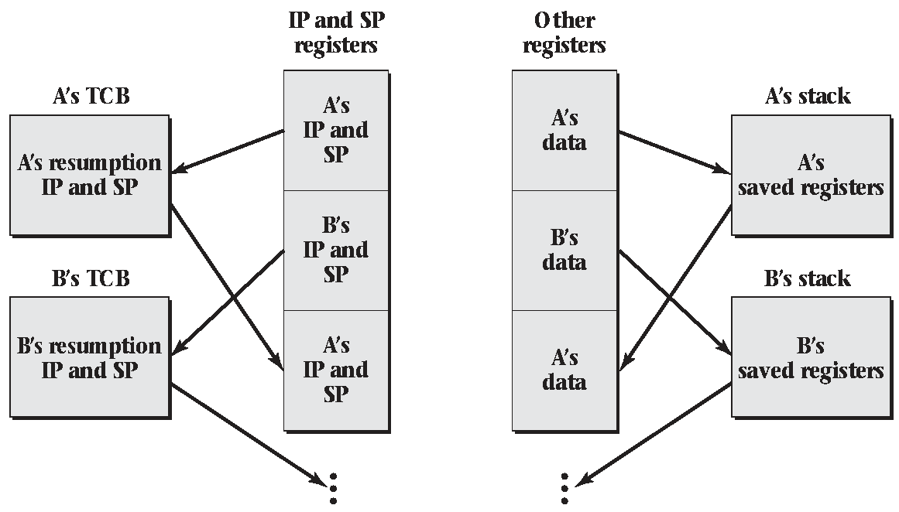
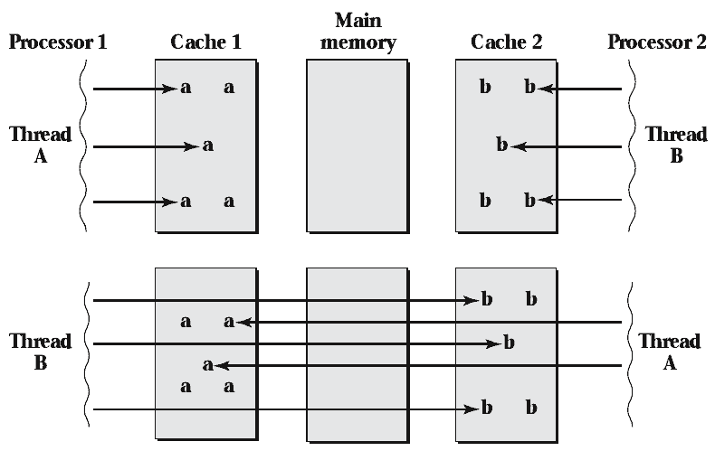

3.3 Scheduling Goals
====================

Scheduling
----------

- Optimize system resources
- Provide snappy user experience

---

---

System Usage
------------

- Many consumer devices (laptops, phones, etc) are idle most of the time
- Servers in data centers often have a backlog of work to do

Performance Goals
-----------------

- Throughput
- Response time

Throughput
----------

- Measure of work done per time
- An example would be requests per second (RPS) for a webserver
- Typically goes down as we change threads more quickly

Context Switching
-----------------

- Changing threads incurs a cost
- State has to be saved to memory when pausing a thread
- State has to be loaded from memory when resuming a thread

---

---

What impact does the cache hierarchy have on context switching?

Cache Hierarchy
---------------

- The implementation of the cache hierarchy makes context switching more expensive
- Another thread will replace many of our cached values

---

How does this effect change in multiprocessor systems?

Multiprocessor Systems
----------------------

- A context switch to another CPU will be much slower
- The threads old cache will be inaccessible from the new CPU
- Processor affinity is helpful to keep threads running on the same CPU

Cache Coherence Protocol
------------------------

- Values that exist in another CPUs cache are especially slow to access
- This further increases the cost of context switches to another CPU

---

Response Time
-------------

- Time to service a single request
- Typically goes down the faster we change contexts

Control Goals
-------------

- Urgency
- Importance
- Resource allocation

Urgency
-------

- How soon a task needs to be completed
- A homework assignment with a due date
- A VOIP packet to send

Importance
----------

- How critical the task is to complete
- Your graduation application

Urgency and Importance
----------------------

- Orthogonal concepts
- A task can be urgent without being import or important without being urgent

Resource allocation
-------------------

- How to split resources between users

Scheduling Goals
----------------

- Performance
  - Throughput
  - Response Time
- Control
  - Urgency
  - Importance
  - Resource allocation
