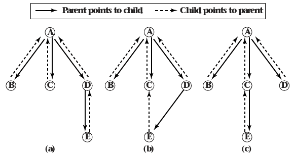

- Exam Results

Atomic Transactions
===================

Invariant
---------

- Property of a mathematical object
- Holds true after certain classes of operations
- In CS, often a logical assertion is always true in a particular phase of execution

Monitor objects
---------------

- Preserve invariant using mutexes for public methods
- Interleaving is not allowed, so object state is always consistent

---

What if invariants span multiple objects?

---

Rooted Tree
-----------

- Tree data structure
- Pointers from parent to child
- Pointers from child to parent

---

Atomic Transaction
-----------------

- Operation that transitions a system from one observable state to another
- No intermediate states are visible
- State maintains consistency across transactions
- Often simply referred to as transactions

Atomicity
---------

- Entire transaction succeeds or fails
- State is always consistent

Durability
----------

- A completed transaction will be reflected in the system state even if the system crashes

ACID
----

- Atomicity
- Concurrency
- Isolation
- Durability
