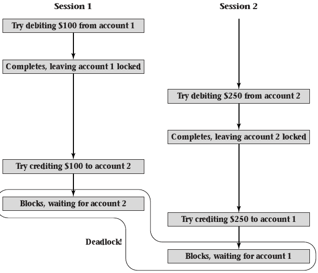
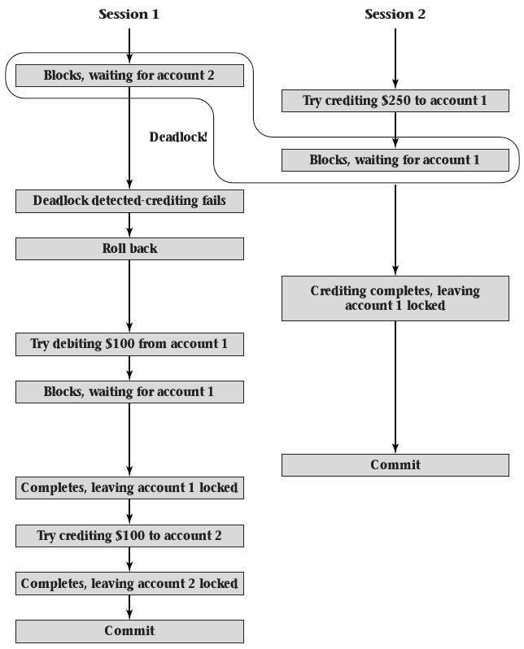
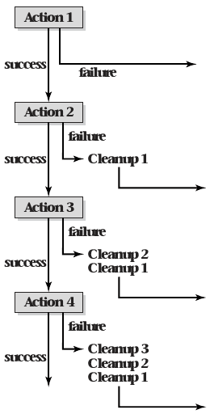

5.2 Atomic Transaction Examples
===============================

Example
-------

- Bank accounts
- Concurrent sessions attempting to transfer money between the same pair of accounts

---

---

Rollback
--------

- Deadlocks can be detected
- Completed work can be undone
- Intermediate state will not be visible to others

---

{height=540px}

File system Example
------------------

- File system metadata must stay consistent when power fails
- Journaling file systems make use of the concept of a rollback to ensure consistency

5.3 Atomic Transaction Mechanisms
=================================

Guarantees
----------

- Current transactions are isolated from one another
- Failed transactions have no visible effects

Serializability
===============

---

- Concurrent transactions may execute simultaneously as long as they do not interfere
- They must execute as if running serially
- Execution that is equivalent to serial executions is called serializable

Notation
--------

- $r_j(x)$ - Read x by transaction j
- $w_j(x)$ - Write x by transaction j
- $s_j(x)$ or $e_j(x)$ - Lock (shared or exclusive)
- $\overline{s}_j(x)$ or $\overline{e}_j(x)$ - Unlock (shared or exclusive)
- $u_j(x)$ - Upgrade lock from shared to exclusive

History
-------

- Sequence of actions executed by a transaction
- May be interleaved with other transaction histories
- Full set of histories is the system history

Example Serial History
----------------------

- Two variables x and y both initialized to 5
- Transaction 1 adds 3 to each
- Transaction 2 doubles each
- An invariant of the system is that x and y must always be equal

---

Serial history with T1 first
----------------------------

- $e_1(x)$, $r_1(x,5)$, $w_1(x,8)$, $\overline{e}_1(x)$
- $e_1(y)$, $r_1(y,5)$, $w_1(y,8)$, $\overline{e}_1(y)$
- $e_2(x)$, $r_2(x,8)$, $w_2(x,16)$, $\overline{e}_2(x)$
- $e_2(y)$, $r_2(y,8)$, $w_2(y,16)$, $\overline{e}_2(y)$

---

Is there an alternative serial history that produces different results?

Serial history with T2 first
----------------------------

- $e_2(x)$, $r_2(x,5)$, $w_2(x,10)$, $\overline{e}_2(x)$
- $e_2(y)$, $r_2(y,5)$, $w_2(y,10)$, $\overline{e}_2(y)$
- $e_1(x)$, $r_1(x,10)$, $w_1(x,13)$, $\overline{e}_1(x)$
- $e_1(y)$, $r_1(y,10)$, $w_1(y,13)$, $\overline{e}_1(y)$

Serializable History with T1 first
----------------------------------

- $e_1(x)$, $r_1(x,5)$, $w_1(x,8)$, $\overline{e}_1(x)$
- $e_2(x)$, $r_2(x,8)$, $w_2(x,16)$, $\overline{e}_2(x)$
- $e_1(y)$, $r_1(y,5)$, $w_1(y,8)$, $\overline{e}_1(y)$
- $e_2(y)$, $r_2(y,8)$, $w_2(y,16)$, $\overline{e}_2(y)$

Nonserializable History
--------------------

- $e_1(x)$, $r_1(x,5)$, $w_1(x,8)$, $\overline{e}_1(x)$
- $e_2(x)$, $r_2(x,8)$, $w_2(x,16)$, $\overline{e}_2(x)$
- $e_2(y)$, $r_2(y,5)$, $w_2(y,10)$, $\overline{e}_2(y)$
- $e_1(y)$, $r_1(y,10)$, $w_1(y,13)$, $\overline{e}_1(y)$

Proving equivalence
-------------------

- One history can be converted to another using equivalence-preserving swaps
- Swapped actions must be from different transactions. An individual transaction's operations may not be reordered.
- Cannot be one of the conflicting pairs

Lock consistency conflicts
--------------------------

- $\overline{e}_j(x)$, $s_k(x)
- $\overline{e}_j(x)$, $e_k(x)
- $\overline{s}_j(x)$, $e_k(x)
- $\overline{s}_j(x)$, $u_k(x)

Data order conflicts
--------------------

- $w_j(x)$, $r_k(x)
- $r_j(x)$, $w_k(x)
- $w_j(x)$, $w_k(x)

Conflict notes
--------------

- All conflicts involve operations on the same entity
- Reads against the same entity may be reordered without harm

Two-phase locking
-----------------

- Set of locking rules that ensure serializability
- Transactions include a locking and unlocking phase

Two-phase locking rules
-----------------------

- Transaction locks an entity exactly once before it reads or writes
- Transaction unlocks an entity exactly once after it last reads or writes
- Exclusive locks are obtained or upgraded before writing
- All lock operations are performed before and unlock operations

Two-phase locking benefit
-------------------------

- A system that follows two-phase locking with guarantee serializable transactions
- The textbook includes a proof of this

Implementation
--------------

- Programmers would have difficulty obeying these rules
- Can we follow two-phase locking automatically

Automated two-phase locking
---------------------------

- Immediately before reading, acquire lock if not already held
- Immediately before writing, acquire or upgrade to exclusive lock if not already held
- Unlock all locks at the end of the transaction

Serial vs Serializable
----------------------

- Serial operations happen in order without concurrency
- Serializable operations allow concurrency while preserving correctness

Failure Atomicity
=================

---

- Transactions may put the system in an inconsistent state
- This state must not be visible to others during the transaction
- This state must not be visible to others if the transaction fails

---

- We can hide inconsistent state using locks
- What do we do on failure?

Failure Handlers
----------------

- Test for failure at each step
- Provide an appropriate handler to undo any work

---

Undo Logging
------------

- Manage and store undo steps automatically
- Each transaction maintains a logically independent log
- Roll back changes on failure
