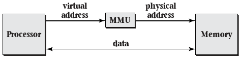

6.2 Uses for Virtual Memory
===========================

Memory Protection
-----------------

- Share memory creates concurrency challenges
- What if each thread had private memory

Virtual Memory
--------------

- Provides memory privacy
- Provides many other applications

Addressing
----------

- Addresses are used to look up memory locations
- Virtual memory decouples addresses that programs use to identify memory from physical memory locations
- Virtual addresses are used by software
- Physical addresses are real locations in hardware

---

{height=540px}

---

Address Mapping
---------------

- Load and store operations are given virtual addresses
- Memory management unit (MMU) is used to translate addresses

---

Virtual Memory Properties
-------------------------

- Virtual to physical mapping stored in a table to be general and configurable
- To keep table size manageable, addresses are grouped into pages
- Table contents are controlled by OS
- Table can be sparse. Undefined pages are illegal to use (page fault).
- Pages may have more granular permission (R/W)