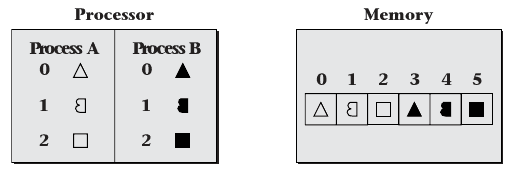
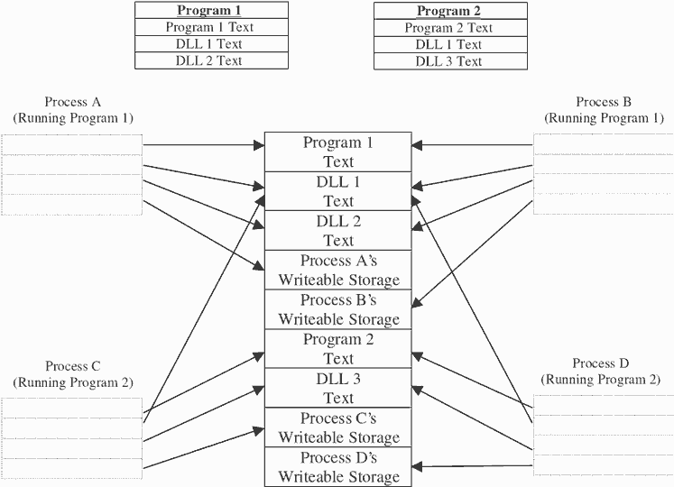
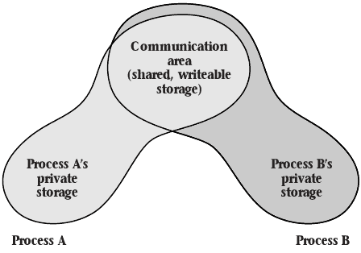
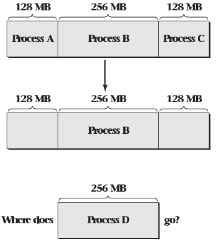
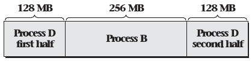
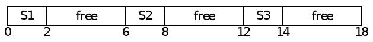

6.2 Uses for Virtual Memory
===========================

Memory Protection
-----------------

- Share memory creates concurrency challenges
- What if each thread had private memory

Virtual Memory
--------------

- Provides memory privacy
- Provides many other applications

Addressing
----------

- Addresses are used to look up memory locations
- Virtual memory decouples addresses that programs use to identify memory from physical memory locations
- Virtual addresses are used by software
- Physical addresses are real locations in hardware

---

{height=540px}

---

Address Mapping
---------------

- Load and store operations are given virtual addresses
- Memory management unit (MMU) is used to translate addresses

---

Virtual Memory Properties
-------------------------

- Virtual to physical mapping stored in a table to be general and configurable
- To keep table size manageable, addresses are grouped into pages
- Table contents are controlled by OS
- Table can be sparse. Undefined pages are illegal to use (page fault).
- Pages may have more granular permission (R/W)

Uses
----

- Private storage
- Controlled sharing
- Flexible allocation
- Sparse address spaces
- Persistence
- Demand-driven loading
- Efficient zero filling
- Substituting disk for RAM

Private Storage
---------------

- Each computation should be able to use whatever virtual addresses it finds most convenient for its objects, without needing to avoid using the same address as some other computation
- Each computation’s objects should be protected from accidental (or malicious) access by other computations

Process
-------

- Group of one or more threads in a protection context
- Protection context is a broad idea. For now, it means an isolated virtual address space

---

{height=540px}

Controlled Sharing
------------------

- Certain memory areas can be shared by multiple processes
- Can facilitate communication
- Can reduce memory usage

---

---

Flexible Memory Allocation
--------------------------

- Virtual memory allows physical memory to be allocated and deallocated more freely
- A single process can be allocated pages from all over physical memory
- These pages appear as a single unified (and often contiguous) address space

---

---

Sparse Address Spaces
---------------------

- Processes need not have all addresses mapped
- This can allow data structure space to grow without wasting memory

---

Persistence
-----------

- Memoruy addresses don't have to correspond to physical memory
- The OS may provide the ability to map a persistent storage medium to a process address space

Demand Driven Loading
---------------------

- Many progrms are large
- Conceptually, these programs need to be loaded before being run
- Virtual memory can be used to load portions of these programs as needed

Efficient Zero-filling
----------------------

- Memory allocated to a process should be zeroed before use
- This task takes time
- An OS can avoid it by assigning copies of a read-only zeroed page to processes
- Pages can be swapped out when writes occur

Substituting Disk Storage for RAM
---------------------------------

- Peristent storage is typically cheaper than RAM
- Virtual memory provides the tools to move rarely used memory pages to persistent storage
