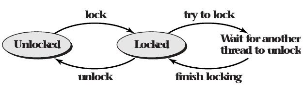

# 4.3 Mutexes and Monitors

## Data Races

- Sharing data between threads can cause issues
- This can be resolved by using a lock to gain exclusive access

## Mutual Exclusion Lock

- Provided by the OS
- Commonly known as a mutex

## Mutex POSIX API

## States

- Locked (held by some thread)
- Unlocked (not held by any thread)

## Unlock Operation

- Only allowed when the mutex is locked
- Returns immediately

## Lock Operation

- Allowed on locked and unlocked mutexes
- May force the caller to wait until the lock is unlocked by another thread

---



## POSIX API

```c
pthread_mutex_t my_mutex;
pthread_mutex_init(&my_mutex, 0);
pthread_mutex_lock(&my_mutex);
// operate on the protected data structure
pthread_mutex_unlock(&my_mutex);
// destroy when done
pthread_mutex_destroy(&my_mutex);
```
