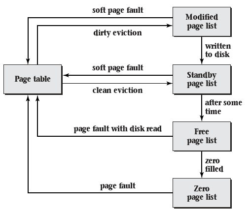

6.4 Policies for Virtual Memory
===============================

Policies
--------

- Mechanisms for operations have been described
- When and how should these mechanisms be applied?

Questions
---------

- At what point is a page assigned a page frame?
- Which page frame is assigned to each page?
- If the operating system needs to move some inactive page to disk in
order to free up a page frame, which page does it choose?

Fetch Policy
------------

- The OS may assign pages for all program data when a process is started
- The OS may wait for page faults before assigning any pages
- The OS may do something in between

Prepaging
----------

- All pages are available without causing page faults
- Programs are slow to load, as all pages must be mapped before executing any code

Demand Paging
-------------

- Pages are loaded and mapped in response to page faults
- Does not waste time creating unused mappings

Choosing Demand Paging
----------------------

- Limited spatial locality making page prediction difficult
- Low cost of page faults

Linux Example
-------------

- Uses demand paging for zero-filled pages because the cost for a fault is very low
- Uses a variant of prepaging for pages loaded from disk
- Uses demand paging for random access to memory-mapped files

Clustered Paging
----------------

- Page faults load a cluster of neighboring pages
- Linux defaults to loading 16 aligned pages surrounding the requested page
- Windows uses different cluster sizes for instructions and data
- Clustered paging provides benefit because disk access is typically latency bound rather than bandwidth bound

Placement Policy
----------------

- Determines where to place a frame

Placement Considerations
------------------------

- Spatial locality for cache performance
- NUMA nodes
- Energy efficiency (allow some memory chips to enter low power states)

Caching
-------

- Conflict (rather than capacity) misses can occur when addresses are poorly chosen
- Address coloring or bin hopping are techniques to help avoid an increase in conflict misses from virtual memory

Replacement Policy
------------------

- Pages may be evicted from memory and stored to disk when memory space is limited
- This can happen as pages are requested
- Most operating systems choose to keep some number of pages available and perform evictions in the background

Advantages to early evictions
-----------------------------

- Lower latency for applications that experience page faults
- Combining disk write back operations
- Page frames that have been marked freed can be reused if an application request them before they are handed over to a new application

---

