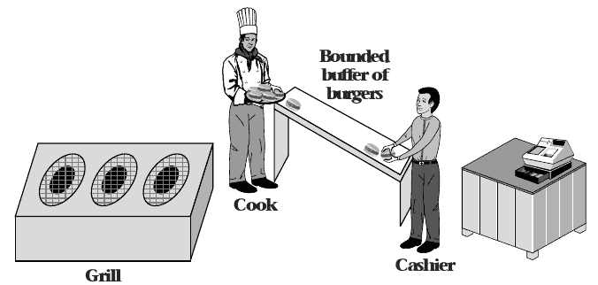

4.4 Other Synchronization Patterns
=================================

Producer-consumer model
-----------------------

- One thread produces data consumed by another thread
- Can be implemented sequentially
- Can be implemented as threads that wait on one another, but with limited concurrency

Concurrency
-----------

- Producer and consumer run at the same time
- Producer creates output and stores it
- Consumer grabs input as needed from storage

Bounded Buffer
--------------

- Provides storage space for producer output
- Limited in space because space is finite and larger size produces diminishing returns
- When buffer is empty, consumer must wait
- When buffer is full, producer must wait

---



Spin-waiting Producer
------------

```python
producer:
    while True:
        queue.lock()
        while (queue.isFull()):
            queue.unlock()
            queue.lock()

        queue.append(task)
        queue.unlock()
```

Spin-waiting Consumer
------------

```python
consumer:
    while True:
        queue.lock()
        while (queue.isEmpty()):
            queue.unlock()
            queue.lock()

        task = queue.pop()
        doStuff(task)
        queue.unlock()
```

Pipes
-----

- Provide OS-level support for bounded buffers between processes
- `du | sort -n`
