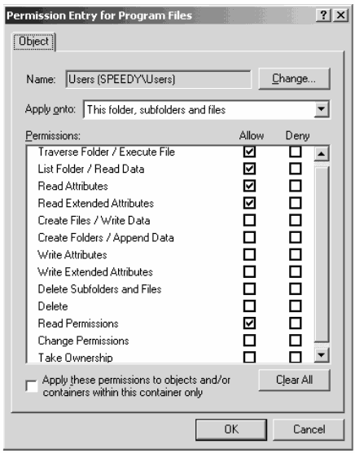

7.3 Protecting Memory
=====================

Virtual Memory
--------------

- Provides the framework for memory protection
- Different mapping can be used for different processes
- Mappings can include memory permission bits

Processor Modes
---------------

- Code running as part of a user application may only access its own memory (user mode)
- Code running as part of the OS needs access to everything (kernel mode)

Kernel Mode
-----------

- All instructions are available
  - I/O
  - Change modes
  - Change memory permissions

User Mode
---------

- Normal instructions are usable
- Priviledged instructions will fail
- Illegal instructions are caught by the OS (trap)

System Calls
------------

- Effectively illegal operations
- OS traps the call and performs some requested operation
- Control typically returns to the process that requested the system call

Threads
-------

- Can be implemented differently based on protection level and mode switch
- Kernel thread - run and scheduled in kernel mode
- Native thread (or just thread) - run in user mode, scheduled in kernel mode
- User thread - run and scheduled in user mode

Multiple Address Spaces
-----------------------

- Each process has its own virtual address space
- Used by OS X, Windows, Linux, etc
- Memory mappings are used to control permissions and access

7.4 Representing Access Rights
==============================

Protection system
-----------------

- Controls access to objects by subjects
- Object is what is being protected
- Subject is trying to access the object

Operations
----------

- Associated with an object
- Can be performed by a subject

Access Right
------------

- Permission for a subject to perform an operation on an object

Principal
---------

- Rights are attached to subjects
- A *principal* is often used to determine appropriate rights
- Processes may be the subject, but their rights reflect those of the user that owns them

Capabilities
------------

- Indirect reference to object
- Includes information needed to locate object and a set of access rights
- Also known as handles (Windows) and descriptors (POSIX)

Access Control List
-------------------

- List of access rights associated with an object

Example
-------

```
> getfacl /bin/ls

# file: bin/ls
# owner: root
# group: root
user::rwx
group::r-x
other::r-x
```

---



--- 

POSIX file permissions
----------------------

- `r` - Read
- `w` - Write
- `x` - Execute

POSIX directory permissions
----------------------------

- `r` - List
- `w` - Create/rename/delete files in directory
- `x` - Traverse a directory (access files if name already known)
- Common combinations are `rwx`, `r-x`, and `---`

Security and Protection
-----------------------

- Protection is essential for security, but it is not equivalent to security
- ACLs and other measures must be applied carefully and correctly to provide security

Users and processes
-------------------

- Processes are run using user credentials
- They may take actions that a user did not intend
- An example is a trojan horse program

Worms
-----

- Trojan horse programs that execute malicious code and redistribute themselves to others
- Often sent via email

setuid
------

- Some programs run by users need elevated permissions
- This can be achieved by allowing programs to run as the user who owns the program rather than the user who executes it
- These programs must be written carefully and securely to prevent these permissions from spilling over into child process or other operations
