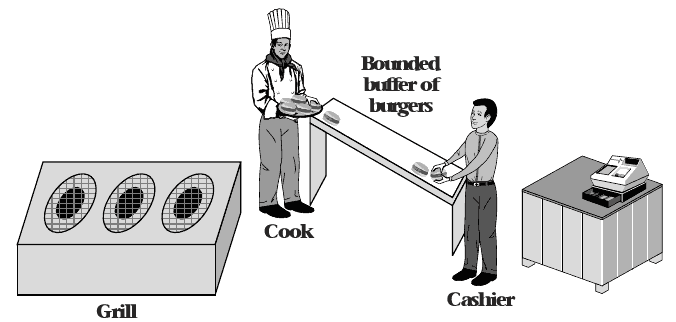
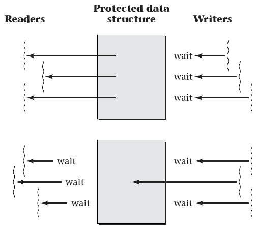
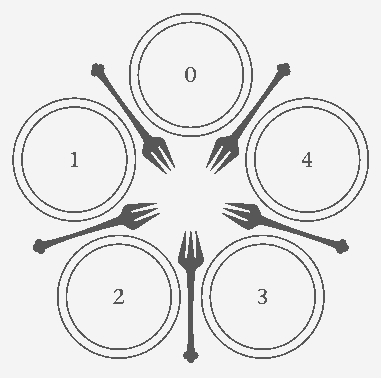
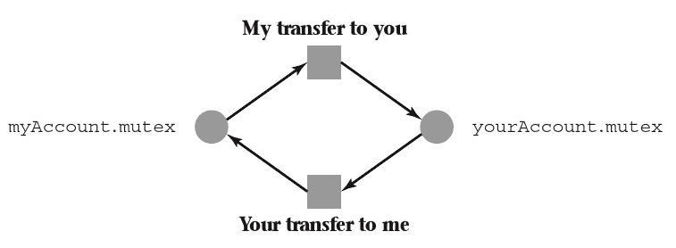

# 4.4 Synchronization Patterns

## Producer-consumer model

- One thread produces data consumed by another thread
- Can be implemented sequentially
- Can be implemented as threads that wait on one another, but with limited concurrency

## Concurrency

- Producer and consumer run at the same time
- Producer creates output and stores it
- Consumer grabs input as needed from storage

## Bounded Buffer

- Provides storage space for producer output
- Limited in space because space is finite and larger size produces diminishing returns
- When buffer is empty, consumer must wait
- When buffer is full, producer must wait

---



## Spin-waiting Producer

```python
producer:
    while True:
        queue.lock()
        while (queue.isFull()):
            queue.unlock()
            queue.lock()

        queue.append(task)
        queue.unlock()
```

## Spin-waiting Consumer

```python
consumer:
    while True:
        queue.lock()
        while (queue.isEmpty()):
            queue.unlock()
            queue.lock()

        task = queue.pop()
        doStuff(task)
        queue.unlock()
```

## Pipes

- Provide OS-level support for bounded buffers between processes
- `du | sort -n`

## Readers/Writers Locks

- Alternative to mutex
- Allows lock to specify whether thread is reading or writing
- Only one writer may access the mutex at a time, but multiple readers are allowed

---



## Barriers

- Requires multiple concurrent threads to finish a task before moving on
- Similar to our use `pthread_join`, but does not require threads to terminate

## Condition Variables

- Provide a way to bundle multiple threads waiting on the same condition
- A signaling mechanism is used to wake threads when the condition is met

## Condition Variable Producer

```python
producer:
    while True:
        queue.lock()
        while (queue.isFull()):
            queue.unlock()
            wait(fullCV) # Sleep
            queue.lock()

        queue.append(task)
        signal(emptyCV)
        queue.unlock()

```

## Condition Variable Consumer

```python
consumer:
    while True:
        queue.lock()
        while (queue.isEmpty()):
            queue.unlock()
            wait(emptyCV) # Sleep
            queue.lock()

        task = queue.pop()
        signal(fullCV)
        doStuff(task)
        queue.unlock()
```

## Semaphores

- Somewhat similar to a mutex, but can take on values other than 0 and 1
- A semaphore that uses only 0 and 1 is a mutex
- Larger counter values can be useful when implementing bounded buffers or other concurrency mechanisms

# 4.7 Deadlocks

## Concurrency

- Addresses problems of responsiveness and throughput
- Creates problems with data races
- Races can be resolved using synchronization patterns

---

What problems can be caused by synchronization?

## Example

```python
def transfer(srcAccount, dstAccount):
  lock(srcAccount.mutex)
  lock(dstAccount.mutex)
  srcAccount.balance = srcAccount.balance - amount
  dstAccount.balance = dstAccount.balance + amount
  unlock(srcAccount.mutex)
  unlock(dstAccount.mutex)
```

## Analysis

- Mutexes prevent race conditions
- Transfers will generally work correctly
- What if two accounts transfer to one another concurrently?

## Deadlock

- Each thread locks the first mutex and waits for the second
- They now have a circular dependency and will never progress or unlock their mutex

## Deadlock conditions

1. Threads hold resources exclusively
2. Threads hold some resources while waiting for others
3. Resources cannot be removed from threads by force
4. Threads wait in a circular chain

---



## Addressing Deadlocks

- Detection and mitigation
- Prevention

## Detection

- OS stores additional information about mutexes
- Track which thread holds a mutex
- Record which mutex a thread is waiting for
- Use this graph to periodically check for cycles (deadlocks)

---



## Breaking the Deadlock

- A thread can be rolled back to before it attempted the offending lock
- Most systems don't support rolling back threads
- Killing a thread is the typical solution

## Immediate detection

- If we detect deadlock conditions when the last lock in the cycle is attempted, we can notify applications and they can choose to take appropriate action

## Prevention Through Resource Ordering

- Requires resources to have global IDs
- When locking resources, lock them in order by ID

## Example

```python
def transfer(srcAccount, dstAccount):
  lock(min(srcAccount, dstAccount).mutex)
  lock(max(srcAccount, dstAccount).mutex)
  srcAccount.balance = srcAccount.balance - amount
  dstAccount.balance = dstAccount.balance + amount
  unlock(srcAccount.mutex)
  unlock(dstAccount.mutex)
```

## Linux Scheduler Example

```c
static void double_rq_lock(struct rq *rq1, struct rq *rq2) {
  if (rq1 == rq2) {
    raw_spin_lock(&rq1->lock);
  } else {
    if (rq1 < rq2) {
      raw_spin_lock(&rq1->lock);
      raw_spin_lock(&rq2->lock);
    } else {
      raw_spin_lock(&rq2->lock);
      raw_spin_lock(&rq1->lock);
    }
  }
}

```
