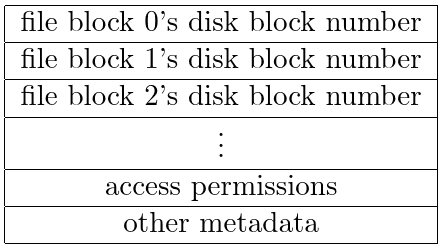
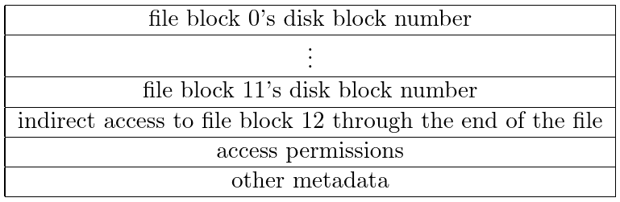
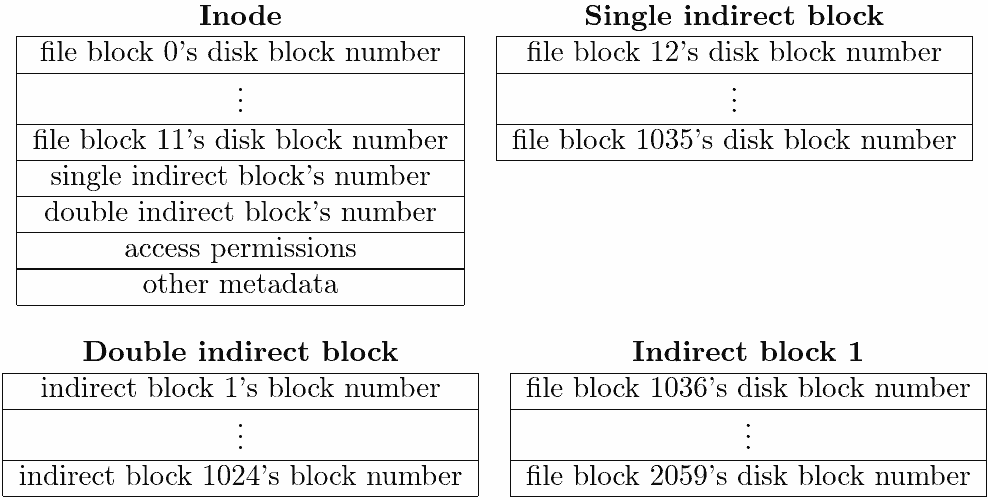
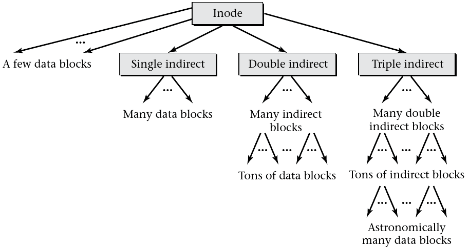

8.4 Disk Space Allocation
=========================

Virtual Memory
--------------

- Maps virtual address space to physical memory (typically DRAM)
- Storage is not persistent
- Mapping happens in chunks called pages

File System
-----------

- Maps positions in files to persistent storage (typically disks)
- Storage is persistent
- Mapping happens in chunks called blocks

Allocations
-----------

- Any block in a file could be mapped to any block on a disk
- Not all choices are equal
- Goal is to optimize space and time usage

Wasted Space
------------

- Blocks are fixed sizes
- Using less than a full block of space creates unused space that can never be used

Internal Fragmentation
----------------------

- Unusable space that is allocated, but not available for use
- Occurs in the empty space at the end of blocks

External Fragmentation
----------------------

- Unusable space that is not allocated, but too small to be useful
- Occurs in the relatively small gaps between allocated blocks

Extents
-------

- Contiguous chunks of files

Locality Guidelines
-------------------

- Files should be broken into as few extents as possible
- If multiple extents are required, they should be as close as possible
- Files that are used together should be stored together

Locality Policies
-----------------

- Assume files in a directory are used together and store them together
- Measure usage and assume that files that were accessed together with be accessed together in the future

Tracking Allocations
--------------------

- Many implementations
- ext3 stores a bit representing free or used for each block group
- Each block group contains a similar mapping for its blocks

Allocation Policies
-------------------

- Files in a directory will often be stored in a block group to improve locality
- Subdirectories are often stored in new block groups

Delayed Allocation
------------------

- File size is not generally known at creation time
- Writes to files a buffered to RAM before being written to disk
- The OS may choose to buffer many writes in order to determine appropriate file size before performing allocation

8.5 Metadata
============

Metadata
--------

- Data about data
- Information about where block of a file are stored
- File access control
- Dates and times

File Names
----------

- Not really metadata
- Names provide a reference to a file
- Names are not a property of a file
- Multiple names can point to the same file

Data Location Metadata
----------------------

- ext3 stores file metadata in blocks called inodes
- Each inode stores file metadata including data locations
- inodes are stored in a linear array
- Each file has a unique inode

---



Example
-------

`ls -i` will list inode numbers

Indirect Blocks
---------------

- We want inodes to be a fixed, relatively small size
- Some files will need more metadata
- inodes are able to link to additional blocks for more metadata

---



Double and Triple Indirection
-----------------------------

- Some files are very large
- We create a deeper tree
- The early blocks are still linked direction from the inode then the single indirect block

---



---



Sparse Files
------------

- It is not necessary for empty blocks to be backed by actual storage
- A large file use sparsely need not take up the full file size on disk

Example
-------

```
> dd if=/dev/zero of=sparsefile count=0 bs=4k seek=1000000000
> ls -s sparsefile
0 -rw-rw-r-- 1 jncraton 3.8T Apr  6 09:11 sparsefile
```

Extents
-------

- Fixed size blocks have some weaknesses
- Large, contiguous files still have to perform many data block lookups
- A single extent could be used to represent a large contiguous file

Extent-based file systems
-------------------------

- NTFS (Windows)
- HFS Plus (Mac OS X)
- XFS (Unix)
- BTRFS (Linux)

Extent Storage
--------------

- Can't be efficiently stored in linear array
- Need to be searchable

Binary Tree
-----------

- Common construct for efficient searching
- Not used for extent storage

Tree height
-----------

- Each layer of the tree requires a disk access
- We want as many nodes linked to a layer as a single disk access can provide

B-Tree
------

- Similar in concept to a binary tree
- Includes many nodes at each layer
- Efficient for storing extent data
- Also commonly used for database indexes

---


Access Control Metadata
-----------------------

- Varies by OS
- POSIX includes fixed-sized metadata
- Other operating systems provide metadata of arbitrary size that needs more complex storage

POSIX Metadata
--------------

- Owner (number)
- Group (number)
- File mode (9 permission bits)
- Stored in [inode](https://github.com/torvalds/linux/blob/3e732ebf7316ac83e8562db7e64cc68aec390a18/include/linux/fs.h#L585)

Other Metadata
--------------

- File size
- Modified, written, accessed times
- Count of names referencing this file
