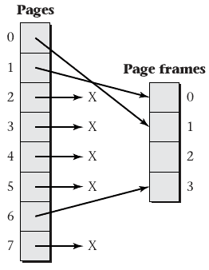
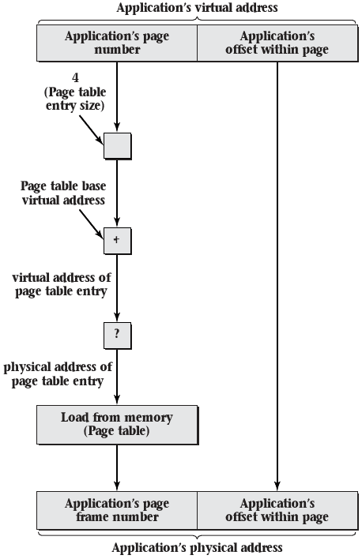
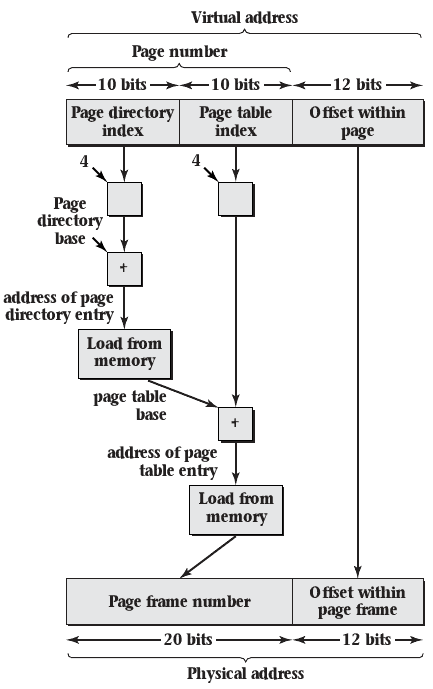

6.2 Uses for Virtual Memory
===========================

Flexible Memory Allocation
--------------------------

- Virtual memory allows physical memory to be allocated and deallocated more freely
- A single process can be allocated pages from all over physical memory
- These pages appear as a single unified (and often contiguous) address space

---

---

Sparse Address Spaces
---------------------

- Processes need not have all addresses mapped
- This can allow data structure space to grow without wasting memory

---

Persistence
-----------

- Memory addresses don't have to correspond to physical memory
- The OS may provide the ability to map a persistent storage medium to a process address space

Demand Driven Loading
---------------------

- Many programs are large
- Conceptually, these programs need to be loaded before being run
- Virtual memory can be used to load portions of these programs as needed

Efficient Zero-filling
----------------------

- Memory allocated to a process should be zeroed before use
- This task takes time
- An OS can avoid it by assigning copies of a read-only zeroed page to processes
- Pages can be swapped out when writes occur

Substituting Disk Storage for RAM
---------------------------------

- Persistent storage is typically cheaper than RAM
- Virtual memory provides the tools to move rarely used memory pages to persistent storage

6.3 Virtual Memory Mechanisms
=============================

Mapping
-------

- Should be configurable
- Should be efficient
- Mapping function for pages of addresses, not single addresses

Null mappings
-------------

- Virtual address pages may map to physical addresses
- They may also map to nothing at all

---

Hardware
--------

- Dedicated hardware (MMU) implements mapping for performance reasons
- OS configures MMU with appropriate mappings

Page table storage
------------------

- Data structure may be stored in memory
- Using the structure from memory at least doubles the number of memory accesses. Why?

Locality
--------

- Memory accesses exhibit spatial and temporal locality
- This can be exploited to create far more efficient memory access

Translation Lookaside Buffer
----------------------------

- MMU stores (caches) recently used translations
- Translation lookaside buffer (TLB) is used to improve performance

Caches
------

- Used to improve latency to access data
- Generally have an inverse relationship between latency and size
- That is, larger caches are necessarily slower

TLB
---

- Should be fast
- Should be large
- Can't be both

Splitting TLB
-------------

- Using a separate TLB for instruction fetches and data loads improves performance
- Locality is improved
- Lookups can happen in parallel
- Caches can be smaller and therefore faster

TLB Hierarchy
-------------

- Just like other caches, architects can include multiple levels of TLB cache
- This ensures extremely fast performance in the common case
- This provides improved performance when the L1 misses and avoids some memory accesses

Combining Entries
-----------------

- Often, systems will perform large allocations of many contiguous addresses
- We can eliminate the number of entries needed in the TLB by allowing a single entry to describe multiple contiguous mappings

Page Size
---------

- Page size will have a strong impact on MMU and TLB latency
- Smaller pages require more entries
- Larger pages make less efficient use of space
- Variable size pages may provide benefits, but increase complexity

Performance Implications
------------------------

- Programs that access memory sequentially will benefit from both TLB hits and data cache hits
- Dense data structures will perform much better than sparse ones
- Shorter programs and shorter jumps will see better TLB performance

Hardware Support
----------------

- Common for MMU to expect page tables in a fixed format
- Register is used to tell the MMU where to look for the page table
- OS stores the page tables to memory and sets this register

Software-only
-------------

- MMU may simply send control to the OS on TLB miss
- OS returns memory mapping to be used and stored in TLB
- Provides slower performance on miss but enhanced flexibility for mapping storage and lookup

Context Switching
-----------------

- Most process need their own memory mapping and page table
- Context switches therefore put pressure on the MMU
- TLB needs to be flushed on switch, or entries need to be tagged with a process ID

Linear Page Tables
------------------

- Store page mapping in a simple array
- Easy to access and reason about
- Waste large amounts of space for largely sparse mapping

---

Valid  Page Frame
-----  ----------
1      1
1      0
0      X
0      X
0      X
0      X
1      3
0      X

Sparse Addresses
----------------

- Most virtual addresses aren't valid mappings
- Modern systems include 64 bit addresses
- Even using absurdly large page sizes in the GB range, multiple GB are still needed to store the page table for each process

Breaking the Page Table into Pages
----------------------------------

- A large linear table can itself be broken into pages
- Only pages that include valid entries need to be stored

---

{height=540px}

Two Level Page Table
---------------------

- Explicitly store directory of pages as one page
- Store page tables as needed referenced from the directory
- Used by 32-bit Intel CPUs

---

---

{height=540px}

---

{height=540px}

Large Pages
-----------

- x86 implementation provides for skipping the page table entirely
- Directory entries include a size bit, which if set indicate a pointer to single large (4MiB) page frame

Multilevel page tables
----------------------

- We can support larger addresses using more levels
- Modern 64-bit system often use 4 layer page tables

---

{height=540px}

Hashed Page Tables
------------------

- Alternative to multilevel page tables
- Use a hash data structure in place of a tree
